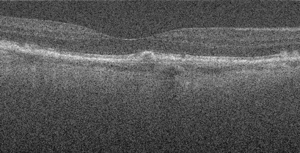

# Adding Images to Your Biomedical AI Presentation

## Overview
Your HTML presentation is ready with animated visual elements and placeholders. To enhance it with actual images from your documents, follow these instructions.

## Image Extraction from Your Documents

### From Word Documents (.docx):
1. Open your Word document
2. Right-click on any image → "Save as Picture"
3. Choose PNG or JPG format
4. Save to the `images/` folder

### From PDF Documents:
1. **Method 1 - Preview (macOS):**
   - Open PDF in Preview
   - Select the image with the selection tool
   - Copy (Cmd+C) and paste into Preview as new document
   - Save as PNG/JPG

2. **Method 2 - Online PDF extractors:**
   - Upload PDF to tools like PDF24 or SmallPDF
   - Extract all images
   - Download and save to `images/` folder

## Key Images to Extract and Add

### 1. **Neural Network Diagrams** (Slide 1, 4, 7)
- Look for: CNN architecture diagrams, transformer models, neural network flowcharts
- Replace: `neural-network-visual` sections
- File naming: `cnn_architecture.png`, `transformer_model.png`

### 2. **OCT Images** (Slide 3, 5)
- Look for: B-scan images, 3D OCT volumes, skin layer segmentations
- Replace: `oct-visual` sections
- File naming: `oct_bscan.png`, `oct_segmentation.png`

### 3. **Fundus Images** (Slide 3, 6)
- Look for: Retinal photographs, diabetic retinopathy examples, optic disc/macula images
- Replace: `fundus-visual` sections
- File naming: `fundus_normal.png`, `fundus_dr.png`

### 4. **Performance Charts** (Slide 6)
- Look for: Accuracy graphs, confusion matrices, ROC curves, performance comparisons
- Replace: `performance-chart` sections
- File naming: `performance_metrics.png`, `confusion_matrix.png`

### 5. **Pipeline Diagrams** (Slide 5, 6)
- Look for: System flowcharts, processing pipelines, workflow diagrams
- Replace: Pipeline visual sections
- File naming: `oct_pipeline.png`, `dr_system_flow.png`

## How to Replace Visual Elements

### Option 1: Simple Image Replacement
Replace animated sections with actual images:

```html
<!-- Replace this animated element: -->
<div class="oct-visual">...</div>

<!-- With this image: -->
<div class="image-container">
    
    <div class="image-caption">OCT B-scan cross-section showing epidermis, dermis, and hypodermis layers</div>
</div>
```

### Option 2: Image with Overlays
Keep some animation but add real background:

```html
<div class="image-container" style="background-image: url('images/your_image.jpg'); background-size: cover;">
    <!-- Keep existing animated elements -->
</div>
```

## Specific Document Content to Look For

### From "DEVELOPMENT OF DEEP LEARNING FOR DIABETIC RETINOPATHY":
- [ ] Fundus image examples (different DR stages)
- [ ] System architecture diagram
- [ ] Performance comparison charts
- [ ] Confusion matrix
- [ ] ROC curves

### From "Thai_OCT-Skin-Image-Processing-Documentation":
- [ ] OCT skin images (raw and processed)
- [ ] Segmentation results
- [ ] Layer identification examples
- [ ] Measurement visualizations

### From OCT Tissue Diagnostics Report:
- [ ] Animal tissue OCT images
- [ ] GradCAM heatmaps
- [ ] Tissue classification results
- [ ] Virtual biomarker examples

## Sample Images Provided

I've created sample SVG images in the `images/` folder:
- `sample_oct_image.svg` - OCT B-scan example
- `sample_fundus_image.svg` - Fundus photography example  
- `performance_chart.svg` - Performance metrics chart

These serve as templates and can be replaced with your actual research images.

## Image Optimization Tips

1. **File Size**: Keep images under 500KB each for fast loading
2. **Resolution**: 800x600px for main visuals, 400x300px for smaller elements
3. **Format**: PNG for diagrams/charts, JPG for photographs
4. **Naming**: Use descriptive names like `oct_segmentation_unet.png`

## Final Steps

1. Extract images from your documents
2. Save them in the `images/` folder with descriptive names
3. Edit the HTML file to replace animated sections with `` tags
4. Test the presentation by opening the HTML file in your browser
5. Adjust image sizes and captions as needed

## Need Help?

If you encounter issues:
1. Check that image paths are correct (`images/filename.ext`)
2. Ensure images are in common formats (PNG, JPG, SVG)
3. Verify file permissions allow reading
4. Test with a simple image first before replacing all visuals

Your presentation will be much more impactful with the actual research images from your biomedical AI work!
